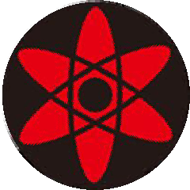
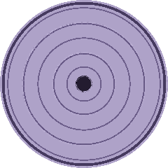

# Sharingan Eyes 👁️👁️

Mắt hoạt hình (animated eyes) trên ESP32 với **lõi mắt thay được lúc chạy** bằng nút bấm:
mắt người → Sharingan tomoe → Mangekyou Kamui (Obito) → Mangekyou vĩnh hằng (Sasuke) → Rinnegan.

Mắt tự đảo tròng, chớp mắt, mí mắt bám theo con ngươi — dựa trên engine
"Uncanny Eyes" của Adafruit, bản port TFT_eSPI cho ESP32.

## Phần cứng

- ESP32 DevKit V1 (loại thông dụng, chip CH340)
- 2 × LCD tròn 1.28" GC9A01, 240×240 (chân BLK, CS, DC, RES, SDA, SCL, VCC, GND)
- 1 nút bấm (đổi lõi mắt)

### Sơ đồ đấu dây

| Chân màn hình | Màn TRÁI | Màn PHẢI | Ghi chú |
|---|---|---|---|
| VCC | 3V3 | 3V3 | ⚠️ Không cắm 5V, không đảo ngược VCC/GND |
| GND | GND | GND | |
| SCL | GPIO 18 | GPIO 18 | SPI clock, dùng chung |
| SDA | GPIO 23 | GPIO 23 | SPI MOSI, dùng chung |
| DC | GPIO 22 | GPIO 22 | Dùng chung |
| RES | GPIO 4 | GPIO 4 | Dùng chung |
| CS | GPIO 5 | GPIO 21 | Mỗi màn một chân riêng |
| BLK | 3V3 | 3V3 | Đèn nền luôn bật |

Nút bấm: một chân **GPIO 27**, chân kia **GND** (dùng pull-up nội, không cần điện trở).

## Build & nạp (PlatformIO)

```bash
pio run -t upload
```

Cổng COM và toàn bộ cấu hình chân TFT_eSPI nằm trong `platformio.ini` (build_flags),
không cần sửa `User_Setup.h` của thư viện. Cấu hình mắt trong `include/config.h`.

## Đổi lõi mắt

Nhấn nút GPIO27: xoay vòng qua 5 lõi. Mỗi lần đổi, firmware in `Doi loi mat -> ...`
ra Serial (115200). Lõi khởi động mặc định đặt trong `main.cpp` (`irisStyleIndex`).

## Tự tạo lõi mắt mới

Engine không nhận ảnh tròn trực tiếp — iris là texture 256×64 "trải" theo tọa độ cực
(cột = góc 0–360°, hàng = bán kính từ mép vào tâm). Dùng script kèm theo:

```bash
python tools/make_iris.py anh_tron.png iris_ten_moi iris_ten_moi.h [cx cy r]
```

Script xuất kèm ảnh `_preview.png` (tái dựng hình tròn) để soát trước khi nạp.
Sau đó: copy file `.h` vào `src/eyes/`, thêm `#include` trong `include/config.h`,
và thêm một dòng vào bảng `irisStyles[]` trong `src/main.cpp` với scale `121, 121`.

> **Lưu ý kỹ thuật:** lõi "phẳng" (texture phủ kín cả vòng iris) phải dùng
> `iScale = 121`, không phải 120. Pixel ngoài vòng tròn iris mang mã polar
> `dist = 127`; cần `121×127/240 = 64 ≥ IRIS_MAP_HEIGHT` để chúng rơi ra lòng
> trắng — với 120 chúng rơi vào hàng 63 của texture và iris sẽ bị **vuông**.
> Lõi mắt người mặc định dùng `IRIS_MIN/IRIS_MAX` (180–280) nên có hiệu ứng
> giãn/co đồng tử; lõi Sharingan cố định đồng tử.

Preview các lõi có sẵn (sinh bởi `make_iris.py`):

| Tomoe | Kamui | Sasuke | Rinnegan |
|---|---|---|---|
|  |  |  |  |

## Ghi công

- Engine gốc: [Uncanny Eyes](https://github.com/adafruit/Uncanny_Eyes) — Phil Burgess / Adafruit
- Port TFT_eSPI + ESP32: dự án ESP32-UncannyEyes (PlatformIO, xem `readme_goc.md`) và các ví dụ Animated Eyes của [Bodmer/TFT_eSPI](https://github.com/Bodmer/TFT_eSPI)
- Lõi Sharingan/Rinnegan + nút đổi lõi lúc chạy + script `make_iris.py`: repo này
